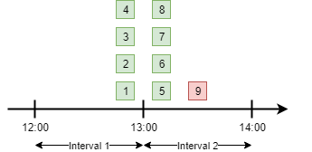
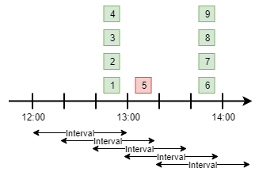

Concurrency & Rate Limiting
===========================

.. note:: Hangfire.Throttling package is a part of `Hangfire.Ace <https://www.hangfire.io/ace/>`_ extensibility set and available on the private NuGet feed.

Hangfire.Throttling package contains advanced types and methods to apply concurrency and rate limits directly to our background jobs without touching any logic related to queues, workers, servers or using additional services. So we can control how many particular background jobs are running at the same point of time  or within a specific time window.

Throttling is performed asynchronously by rescheduling jobs to a later time or deleting them when throttling condition is met, depending on the configured behavior. And while throttled jobs are waiting for their turn, our workers are free to process other enqueued background jobs.

The primary focus of this package is to provide a simpler way of reducing the load on external resources. Databases or third-party services affected by background jobs may suffer from additional concurrency, causing increased latency and error rates. While standard solution to use different queues with a constrained number of workers works well enough, it requires additional infrastructure planning and may lead to underutilization. And throttling primitives are much easier to use for this purpose.

.. admonition:: Everything works on a best-effort basis
   :class: warning

   While it can be possible to use this package to enforce proper synchronization and concurrency control over background jobs, it's very hard to achieve it due to the complexity of distributed processing. There are a lot of things to consider, including appropriate storage configuration, and a single mistake will ruin everything.

   Throttlers apply only to different background jobs, and there's no reliable way to prevent multiple executions of the same background job other than by using transactions in background job method itself. ``DisableConcurrentExecution`` may help a bit by narrowing the safety violation surface, but it heavily relies on an active connection, which may be broken (and lock is released) without any notification for our background job.

Hangfire.Throttling provides the following primitives, all of them are implemented as regular state changing filters that run when a worker is starting or completing a background job. They form two groups, depending on their acquire and release behavior.

`Concurrency Limiters`_

* `Mutexes`_ -- allow only a single background job to be running concurrently.
* `Semaphores`_ – limit how many background jobs are allowed to run concurrently.

`Rate Limiters`_

* `Fixed Window Counters`_ – limit how many job executions are allowed within a given fixed time interval.
* `Sliding Window Counters`_ – limit how many job executions are allowed to run within any specific time interval.
* `Dynamic Window Counters`_ – allow to create window counters dynamically depending on job arguments.

Requirements
------------

Supported only for :doc:`Hangfire.SqlServer <../configuration/using-sql-server>` (better to use ≥ 1.7) and :doc:`Hangfire.Pro.Redis <../configuration/using-redis>` (recommended ≥ 2.4.0) storages. Community storage support will be denoted later after defining correctness conditions for storages.

Installation
------------

The package is available on a private Hangfire.Ace NuGet feed (that's different from Hangfire.Pro one), please see the `Downloads page <https://www.hangfire.io/ace/downloads.html>`_ to learn how to use it. After registering the private feed, we can install the ``Hangfire.Throttling`` package by editing our ``.csproj`` file for new project types:

.. code-block:: xml

   <PackageReference Include="Hangfire.Throttling" Version="1.0.*" />

Alternatively we can use Package Manager Console window to install it using the ``Install-Package`` command as shown below.

.. code-block:: powershell

   Install-Package Hangfire.Throttling

Configuration
-------------

The only configuration method required for throttlers is the ``IGlobalConfiguration.UseThrottling`` extension method. If we don't call this method, every background job decorated with any throttling filter will be eventually moved to the failed state.

.. code-block:: c#
   :emphasize-lines: 3

   GlobalConfiguration.Configuration
       .UseXXXStorage()
       .UseThrottling();

The ``UseThrottling`` method will register all the required filters to make throttling working and add new pages to the Dashboard UI. We can also configure default throttling action to tell the library whether to retry or delete a background job when it's throttled, and specify minimal retry delay (should be greater or equal to 15 seconds) useful for `Concurrency Limiters`_.

.. code-block:: c#
   :emphasize-lines: 3

   GlobalConfiguration.Configuration
       .UseXXXStorage()
       .UseThrottling(ThrottlingAction.RetryJob, TimeSpan.FromMinutes(1));

When using custom ``IJobFilterProvider`` instance that's resolved via some kind of IoC container, we can use another available overload of the ``UseThrottling`` method as shown below. It is especially useful for ASP.NET Core applications that's heavy driven by built-in dependency injection.

.. code-block:: c#
   :emphasize-lines: 3

   GlobalConfiguration.Configuration
       .UseXXXStorage()
       .UseThrottling(provider.Resolve<IJobFilterProvider>, ThrottlingAction.RetryJob, TimeSpan.FromMinutes(1));

Usage
-----

Most of the throttling primitives are required to be created first using the ``IThrottlingManager`` interface. Before creating, we should pick a unique *Resource Identifier* we can use later to associate particular background jobs with this or that throttler instance.

Resource Identifier a generic string of maximum 100 characters, just a reference we need to pick to allow Hangfire to know where to get the primitive's metadata. Resource Identifiers are isolated between different primitive types, but it's better not to use same identifiers to not to confuse anyone.

In the following example, a semaphore is created with the ``orders`` identifier and a limit of 20 concurrent background jobs. Please see later sections to learn how to create other throttling primitives. We'll use this semaphore after a while.

.. code-block:: c#

   using Hangfire.Throttling;

   IThrottlingManager manager = new ThrottlingManager();
   manager.AddOrUpdateSemaphore("orders", new SemaphoreOptions(limit: 20));

Adding Attributes
~~~~~~~~~~~~~~~~~

Throttlers are regular background job filters and can be applied to a particular job by using corresponding attributes as shown in the following example. After adding these attributes, state changing pipeline will be modified for all the methods of the defined interface.

.. code-block:: c#

   using Hangfire.Throttling;

   [Semaphore("orders")]
   public interface IOrderProcessingJobsV1
   {
       int CreateOrder();

       [Mutex("orders:{0}")]
       void ProcessOrder(long orderId);

       [Throttling(ThrottlingAction.DeleteJob)]
       void CancelOrder(long orderId);
   }

Throttling
~~~~~~~~~~

Throttling happens when throttling condition of one of the applied throttlers wasn't satisfied. It can be configured either globally or locally, and default throttling action is to schedule background job to run *one minute* (also can be configured) later. After acquiring a throttler, it's not released until job is moved to a final state to prevent part effects.

Before processing the ``CreateOrder`` method in the example above, a worker will attempt to acquire a semaphore first. On successful acquisition, background job will be processed immediately. But if the acquisition fails, background job is throttled. Default throttling action is ``RetryJob``, so it will be moved to the ``ScheduledState`` with default delay of 1 minute.

For the ``ProcessOrder`` method, worker will attempt to acquire *both* semaphore and mutex. So if the acquisition of a mutex or semaphore, or both of them fails, background job will be throttled and retried, releasing the worker. 

And for the ``CancelOrder`` method, default throttling action is changed to the ``DeleteJob`` value. So when semaphore can't be acquired for that job, it will be deleted instead of re-scheduled.

Removing Attributes
~~~~~~~~~~~~~~~~~~~

It's better not to remove the throttling attributes directly when deciding to remove the limits on the particular method, especially for `Concurrency Limiters`_, because some of them may not be released properly. Instead, set the ``Mode`` property to the ``ThrottlerMode.Release`` value (default is ``ThrottlerMode.AcquireAndRelease``) of a corresponding limiter first.

.. code-block:: c#
   :emphasize-lines: 6

   using Hangfire.Throttling;

   [Semaphore("orders")]
   public interface IOrderProcessingJobsV1
   {
       [Mutex("orders:{0}", Mode = ThrottlerMode.Release)]
       Task ProcessOrderAsync(long orderId);

       // ...
   }

In this mode, throttlers will not be applied anymore, only released. So when all the background jobs processed and corresponding limiters were already released, we can safely remove the attribute. `Rate Limiters`_ don't run anything on the Release stage and are expired automatically, so we don't need to change the mode before their removal.

Concurrency Limiters
--------------------

Mutexes
~~~~~~~

Mutex prevents concurrent execution of *multiple* background jobs that share the same resource identifier. Unlike other primitives, they are created dynamically so we don't need to use ``IThrottlingManager`` to create them first. All we need is to decorate our background job methods with the ``MutexAttribute`` filter and define what resource identifier should be used.

.. code-block:: csharp

   [Mutex("my-resource")]
   public void MyMethod()
   {
       // ...
   }

When we create multiple background jobs based on this method, they will be executed one after another on a best-effort basis with the limitations described below. UIf there's a background job protected by a mutex currently executing, other executions will be throttled (rescheduled by default a minute later), allowing a worker to process other jobs without waiting.

.. admonition:: Mutex doesn't prevent simultaneous execution of the same background job
   :class: warning

   As there are no reliable automatic failure detectors in distributed systems, it is possible that the same job is being processed on different workers in some corner cases. Unlike OS-based mutexes, mutexes in this package don't protect from this behavior so develop accordingly.

   ``DisableConcurrentExecution`` filter may reduce the probability of violation of this safety property, but the only way to guarantee it is to use transactions or CAS-based operations in our background jobs to make them idempotent.

   If a background job protected by a mutex is unexpectedly terminated, it will simply re-enter the mutex. It will be held until background job is moved to the final state (Succeeded, Deleted, but not Failed).

We can also create multiple background job methods that share the same resource identifier, and mutual exclusive behavior will span all of them, regardless of the method name.

.. code-block:: csharp

   [Mutex("my-resource")]
   public void FirstMethod() { /* ... */ }

   [Mutex("my-resource")]
   public void SecondMethod() { /* ... */ }

Since mutexes are created dynamically, it's possible to use a dynamic resource identifier based on background job arguments. To define it, we should use String.Format-like templates, and during invocation all the placeholders will be replaced with actual job arguments. But ensure everything is lower-cased and contains only alphanumeric characters with limited punctuation – no rules except maximum length and case insensitivity is enforced, but it's better to keep identifiers simple.

.. admonition:: Maximal length of resource identifiers is 100 characters
   :class: note

   Please keep this in mind especially when using dynamic resource identifiers.

.. code-block:: csharp

   [Mutex("orders:{0}")]
   public void ProcessOrder(long orderId) { /* ... */ }

   [Mutex("newsletters:{0}:{1}")]
   public void ProcessNewsletter(int tenantId, long newsletterId) { /* ... */ }

Semaphores
~~~~~~~~~~

Semaphore limits concurrent execution of multiple background jobs to a certain maximum number. Unlike mutexes, semaphores should be created first using the ``IThrottlingManager`` interface with the maximum number of concurrent background jobs allowed. The ``AddOrUpdateSemaphore`` method is idempotent, so we can safely place it in the application initialization logic.

.. code-block:: csharp

   IThrottlingManager manager = new ThrottlingManager();
   manager.AddOrUpdateSemaphore("newsletter", new SemaphoreOptions(maxCount: 100));

We can also call this method on an already existing semaphore, and in this case the maximum number of jobs will be updated. If background jobs that use this semaphore are currently executing, there may be temporary violation that will eventually be fixed. So if the number of background jobs is higher than the new ``maxCount`` value, no exception will be thrown, but new background jobs will be unable to acquire a semaphore. And when all of those background jobs finished, ``maxCount`` value will be satisfied.

We should place the ``SemaphoreAttribute`` filter on a background job method and provide a correct resource identifier to link it with an existing semaphore. If semaphore with the given resource identifier doesn't exist or was removed, an exception will be thrown at run-time, and background job will be moved to the Failed state.

.. code-block:: csharp

   [Semaphore("newsletter")]
   public void SendNewsletter() { /* ... */ }

.. admonition:: Multiple executions of the same background job count as 1
   :class: warning

   As with mutexes, multiple invocations of the same background job aren't respected and counted as 1. So actually it's possible that more then the given count of background job methods are running concurrently. As before, we can use ``DisableConcurrentExecution`` to reduce the probability of this event, but we should be prepared for this anyway.

As with mutexes, we can apply the ``SemaphoreAttribute`` with the same resource identifier to multiple background job methods, and all of them will respect the behavior of a given semaphore. However dynamic resource identifiers based on arguments aren't allowed for semaphores as they are required to be created first.

.. code-block:: csharp

   [Semaphore("newsletter")]
   public void SendMonthlyNewsletter() { /* ... */ }

   [Semaphore("newsletter")]
   public void SendDailyNewsletter() { /* ... */ }

Unused semaphore can be removed in the following way. Please note that if there are any associated background jobs are still running, an ``InvalidOperationException`` will be thrown (see `Removing Attributes`_ to avoid this scenario). This method is idempotent, and will simply succeed without performing anything when the corresponding semaphore doesn't exist.

.. code-block:: csharp

   manager.RemoveSemaphoreIfExists("newsletter");

Rate Limiters
--------------

Fixed Window Counters
~~~~~~~~~~~~~~~~~~~~~~

Fixed window counters limit the number of *background job executions* allowed to run in a specific fixed time window. The entire time line is divided into static intervals of a predefined length, regardless of actual job execution times (unlike in `Sliding Window Counters`_). 

Fixed window is required to be created first and we can do this in the following way. First, we need to pick some resource identifier unique for our application that will be used later when applying an attribute. Then specify the upper limit as well as the length of an interval (minimum 1 second) via the options.

.. code-block:: csharp

   IThrottlingManager manager = new ThrottlingManager();
   manager.AddOrUpdateFixedWindow("github", new FixedWindowOptions(5000, TimeSpan.FromHours(1)));

After creating a fixed window, simply apply the ``FixedWindowAttribute`` filter on one or multiple background job methods, and their state changing pipeline will be modified to apply the throttling rules.

.. code-block:: csharp

   [FixedWindow("github")]
   public void ProcessCommits() { /* ... */ }

When background job associated with a fixed window is about to execute, the current time interval is queried to see the number of already performed job executions. If it's less than the limit value, then background job is executed. If not, background job is throttled (scheduled to the next interval by default).

When it's time to stop using the fixed window, we should remove all the corresponding ``FixedWindowAttribute`` filters first from our jobs, and simply call the following method. There's no need to use the ``Release`` mode for fixed windows as in `Concurrency Limiters`_, because they don't do anything on this phase.

.. code-block:: csharp

   manager.RemoveFixedWindowIfExists("github");

Fixed window counter is a special case of the Sliding Window Counter described in the next section, with a single bucket. It does not enforce the limitation that *for any given time interval there will be no more than X executions*. So it is possible for one-hour length interval with maximum 4 executions to have 4 executions at 12:59 and another 4 just in a minute at 13:00, because they fall into different intervals. 

To avoid this behavior, consider using `Sliding Window Counters`_ described below.

However fixed windows require minimal information to be stored unlike sliding windows discussed next – only timestamp of the active interval to wrap around clock skew issues on different servers and know when to reset the counter, and the counter itself. As per the logic of a primitive, no timestamps of individual background job executions are stored.

Sliding Window Counters
~~~~~~~~~~~~~~~~~~~~~~~~

Sliding window counters are also limiting the number of background job executions over a certain time window. But unlike fixed windows, where the whole timeline is divided into large fixed intervals, intervals in sliding window counters (called "buckets") are more fine grained. Sliding window stores multiple buckets, and each bucket has its timestamp and execution counter. 

In the following example we are creating a sliding window counter with one-hour interval and 3 buckets in each interval, and rate limit of 4 executions. 

.. code-block:: csharp

   manager.AddOrUpdateSlidingWindow("dropbox", new SlidingWindowOptions(
       limit: 4,
       interval: TimeSpan.FromHours(1),
       buckets: 3));

After creating a window counter, we need to decorate the necessary background job methods with the ``SlidingWindowAttribute`` filter with the same resource identifier as in the above code snippet to tell state changing pipeline to inject the throttling logic.

.. code-block:: csharp

   [SlidingWindow("dropbox")]
   public void ProcessFiles() { /* ... */ }

Each bucket participates in multiple intervals as shown in the image below, and the *no more than X executions* requirement is enforced for each of those intervals. So if we had 4 executions at 12:59, all background jobs at 13:00 will be throttled and delayed unlike in a fixed window counter.

But as we can see in the picture above, background jobs 6-9 will be delayed to 13:40 and executed successfully at that time, although the configured one-hour interval has not passed yet. We can increase the number of buckets to a higher value, but minimal allowed interval of a single bucket is 1 second. 

.. note::

   So there's always a chance that limits will be violated, but that's a practical limitation – otherwise we will need to store timestamp for each individual background job that will result in an enormous payload size.

When it's time to remove the throttling on all the affected methods, just remove their references to the ``SlidingWindowAttribute`` filter and call the following method. Unlike `Concurrency Limiters`_ it's safe to remove the attributes without changing the mode first, because no work is actually made during the background job completion.

.. code-block:: csharp

   manager.RemoveSlidingWindowIfExists("dropbox");

Dynamic Window Counters
~~~~~~~~~~~~~~~~~~~~~~~

Dynamic window counter allows us to create sliding window counters dynamically depending on background job arguments. It's also possible to set up an upper limit for all of its sliding windows, and even use some rebalancing strategies. With all of these features we can get some kind of fair processing, where one participant can't capture all the available resources that's especially useful for multi-tenant applications.

``DynamicWindowAttribute`` filter is responsible for this kind of throttling, and along with setting a resource identifier we need to specify the window format with String.Format-like placeholders (as in `Mutexes`_) that will be converted into dynamic window identifiers at run-time based on job arguments. 

.. admonition:: Maximal length of resource identifiers is 100 characters
   :class: note

   Please keep this in mind especially when using dynamic resource identifiers.

.. code-block:: c#

   [DynamicWindow("newsletter", "tenant:{0}")]
   public void SendNewsletter(long tenantId, string template) { /* ... */ }

Dynamic Fixed Windows
+++++++++++++++++++++

The following code snippet demonstrates the simplest form of a dynamic window counter. Since there's a single bucket, it will create a fixed window of one-hour length with maximum 4 executions per each tenant. There will be up to 1000 fixed windows to not to blow up the data structure's size.

.. code-block:: c#

   IThrottlingManager manager = new ThrottlingManager();

   manager.AddOrUpdateDynamicWindow("newsletter", new DynamicWindowOptions(
       limit: 4,
       interval: TimeSpan.FromHours(1),
       buckets: 1));

Dynamic Sliding Windows
+++++++++++++++++++++++

If we increase the number of buckets, we'll be able to use sliding windows instead with the given number of buckets. Limitations are the same as in sliding windows, so minimum bucket length is 1 second. As with fixed windows, there will be up to 1000 sliding windows to keep the size under control.

.. code-block:: c#

   manager.AddOrUpdateDynamicWindow("newsletter", new DynamicWindowOptions(
       limit: 4,
       interval: TimeSpan.FromHours(1),
       buckets: 60));

Limiting the Capacity
+++++++++++++++++++++

Capacity allows us to control how many fixed or sliding sub-windows will be created dynamically. After running the following sample, there will be maximum 5 sub-windows limited to 4 executions. This is useful in scenarios when we don't want a particular background job to take all the available resources.

.. code-block:: c#

   manager.AddOrUpdateDynamicWindow("newsletter", new DynamicWindowOptions(
       capacity: 20,
       limit: 4,
       interval: TimeSpan.FromHours(1),
       buckets: 60));

Rebalancing Limits
++++++++++++++++++

When the capacity is set, we can also define dynamic limits for individual sub-windows in the following way. When rebalancing is enabled, individual limits depend on a number of active sub-windows and the capacity. 

.. code-block:: c#

   manager.AddOrUpdateDynamicWindow("newsletter", new DynamicWindowOptions(
       capacity: 20,
       minLimit: 2,
       maxLimit: 20,
       interval: TimeSpan.FromHours(1),
       buckets: 60));

So in the example above, if there are background jobs only for a single tenant, they will be performed at full speed, 20 per hour. But if other participant is trying to enter, existing ones will be limited in the following way. 

* 1 participant: 20 per hour
* 2 participants: 10 per hour for each
* 3 participants: 7 per hour for 2 of them, and 6 per hour for the last
* 4 participants: 5 per hour for each
* ...
* 10 participants: 2 per hour for each

Removing the Throttling
+++++++++++++++++++++++

As with other rate limiters, you can just remove the ``DynamicWindow`` attributes from your methods and call the following methods. There's no need to change the mode to ``Release`` as with `Concurrency Limiters`_, since no logic is running on background job completion.

.. code-block:: c#

   manager.RemoveDynamicWindowIfExists("newsletter");
