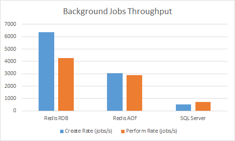

Using Redis
============

.. admonition:: Hangfire Pro subscription required
   :class: note

   Starting from Hangfire 1.2, this feature is a part of `Hangfire Pro <http://hangfire.io/pro/>`_ package set

Hangfire with Redis job storage implementation processes jobs much faster than with SQL Server storage. On my development machine I observed more than 4x throughput improvement with empty jobs (method that does not do anything). ``Hangfire.Pro.Redis`` leverages the ``BRPOPLPUSH`` command to fetch jobs, so the job processing latency is kept to minimum.

Please, see the `downloads page <http://redis.io/download>`_ to obtain latest version of Redis. If you unfamiliar with this great storage, please see its `documentation <http://redis.io/documentation>`_. Binaries for Windows are available through NuGet (`32-bit <https://www.nuget.org/packages/Redis-32/>`_, `64-bit <https://www.nuget.org/packages/Redis-64/>`_) and Chocolatey galleries (`64-bit <http://chocolatey.org/packages/redis-64>`_ only).

Limitations
------------

Multiple Redis endpoints are **only supported** in Redis Cluster configuration starting from `Hangfire.Pro.Redis 2.1.0 <https://www.hangfire.io/blog/2017/04/17/hangfire.pro.redis-2.1.0.html>`_. You can't use multiple detached masters or Redis Sentinel configurations.

Redis Configuration
--------------------

Please read the `official Redis documentation <http://redis.io/documentation>`_ to learn how to configure it, especially `Redis Persistence <http://redis.io/topics/persistence>`_ and `Redis Administration <http://redis.io/topics/admin>`_ sections to get started with the fundamentals. The following options should be configured to run your background jobs smoothly. 

.. admonition:: Ensure the following options are configured
   :class: warning

   These values are default for on-premise Redis installations, but other environments may have different defaults, for example **Azure Redis Cache** and **AWS ElastiCache** **use non-compatible settings** by default.  

.. code-block:: shell

   # Non-zero value cause long-running background jobs to be 
   # processed multiple times due to connection was closed.
   # NOTE: This setting is only required for Hangfire.Pro.Redis 1.x!
   timeout 0

   # Hangfire neither expect that non-expired keys are deleted,
   # nor expiring keys are evicted before the expiration time.
   maxmemory-policy noeviction

Hangfire.Pro.Redis 2.x
-----------------------

Redis ≥ 2.6.12 is required

Installation
~~~~~~~~~~~~~

Ensure that you have configured the private Hangfire Pro NuGet feed as `written here <http://hangfire.io/pro/downloads.html#configuring-feed>`_, and use your favorite NuGet client to install the ``Hangfire.Pro.Redis`` package:

.. code-block:: powershell

   PM> Install-Package Hangfire.Pro.Redis

If your project targets .NET Core, just add a dependency in your ``project.json`` file:

.. code-block:: json

   "dependencies": {
       "Hangfire.Pro.Redis": "2.0.2"
   }

Configuration
~~~~~~~~~~~~~~

After installing the package, a couple of the ``UseRedisStorage`` extension method overloads will be available for the ``IGlobalConfiguration`` interface. They allow you to configure Redis job storage, using both *configuration string* and Hangfire-specific *options*.

Connection string
^^^^^^^^^^^^^^^^^

The basic one is the following, will connect to the Redis on *localhost* using the default port, database and options:

.. code-block:: csharp

   GlobalConfiguration.Configuration.UseRedisStorage();

For ASP.NET Core projects, call the ``UseRedisStorage`` method from the ``AddHangfire`` method delegate: 

.. code-block:: csharp

   services.AddHangfire(configuration => configuration.UseRedisStorage());

You can customize the connection string using the StackExchange.Redis' configuration string format. Please read `their documentation <https://github.com/StackExchange/StackExchange.Redis/blob/master/Docs/Configuration.md>`_ for details. The values for the following options have their own defaults in Hangfire, but can be overriden in the *connection string*:

=============== =======
Option          Default
=============== =======
``syncTimeout`` ``30000``
``allowAdmin``  ``true``
=============== =======

.. code-block:: csharp

   GlobalConfiguration.Configuration
       .UseRedisStorage("contoso5.redis.cache.windows.net,abortConnect=false,ssl=true,password=...");

In .NET Core you need to use IP addresses instead, because DNS lookup isn't available in StackExchange.Redis for .NET Core.

.. code-block:: csharp

   GlobalConfiguration.Configuration
       .UseRedisStorage("127.0.0.1");

Passing options
^^^^^^^^^^^^^^^

You can also pass the Hangfire-specific options for Redis storage by using the ``RedisStorageOptions`` class instances:

.. code-block:: csharp

   var options = new RedisStorageOptions
   {
       Prefix = "hangfire:app1:",
       InvisibilityTimeout = TimeSpan.FromHours(3)
   };

   GlobalConfiguration.Configuration.UseRedisStorage("localhost", options);

The following options are available for configuration:

============================ ============================ ===========
Option                       Default                      Description
============================ ============================ ===========
Database                     ``null``                     Redis database number to be used by Hangfire. When null, then the defaultDatabase option from the configuration string is used.
InvisibilityTimeout          ``TimeSpan.FromMinutes(30)`` Time interval, within which background job is considered to be still successfully processed by a worker. When a timeout is elapsed, another worker will be able to pick the same background job.
Prefix                       ``hangfire:``                Prefix for all Redis keys related to Hangfire.
MaxSucceededListLength       ``10000``                    Maximum visible background jobs in the succeeed list to prevent it from growing indefinitely.
MaxDeletedListLength         ``1000``                     Maximum visible background jobs in the deleted list to prevent it from growing indefinitely.
SubscriptionIntegrityTimeout ``TimeSpan.FromHours(1)``    Timeout for subscription-based fetch. The value should be high enough enough (hours) to decrease the stress on a database. This is an additional layer to provide integrity, because otherwise subscriptions can be active for weeks, and bad things may happen during this time.
============================ ============================ ===========

Hangfire.Pro.Redis 1.x
-----------------------

This is the old version of Redis job storage for Hangfire. It is based on `ServiceStack.Redis 3.71 <https://github.com/ServiceStack/ServiceStack.Redis/tree/v3>`_, and has no SSL and .NET Core support. No new features will be added for this version. **This version is deprecated**, switch to the new version to get the new features.

Configuration
~~~~~~~~~~~~~~

Hangfire.Pro.Redis package contains some extension methods for the ``GlobalConfiguration`` class:

.. code-block:: c#

   GlobalConfiguration.Configuration
       // Use localhost:6379
       .UseRedisStorage();
       // Using hostname only and default port 6379
       .UseRedisStorage("localhost");
       // or specify a port
       .UseRedisStorage("localhost:6379");
       // or add a db number
       .UseRedisStorage("localhost:6379", 0);
       // or use a password
       .UseRedisStorage("password@localhost:6379", 0);

   // or with options
   var options = new RedisStorageOptions();
   GlobalConfiguration.Configuration
       .UseRedisStorage("localhost", 0, options);

Connection pool size
~~~~~~~~~~~~~~~~~~~~~

Hangfire leverages connection pool to get connections quickly and shorten their usage. You can configure the pool size to match your environment needs:

.. code-block:: c#

   var options = new RedisStorageOptions
   {
       ConnectionPoolSize = 50 // default value
   };

   GlobalConfiguration.Configuration.UseRedisStorage("localhost", 0, options);

Using key prefixes
~~~~~~~~~~~~~~~~~~~

If you are using a shared Redis server for multiple environments, you can specify unique prefix for each environment:

.. code-block:: c#

   var options = new RedisStorageOptions
   {
       Prefix = "hangfire:"; // default value
   };

   GlobalConfiguration.Configuration.UseRedisStorage("localhost", 0, options);
