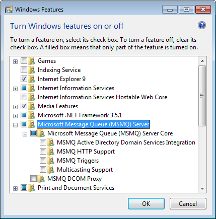
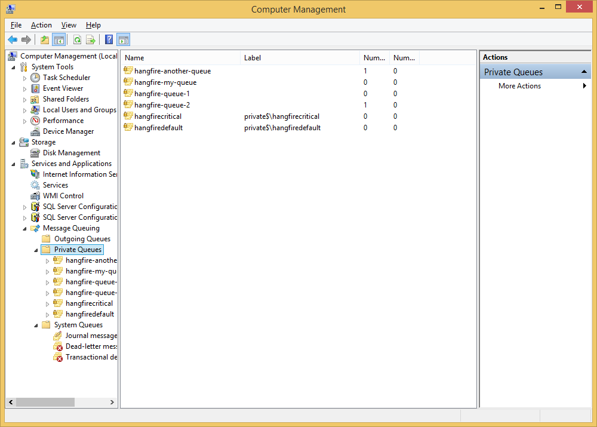
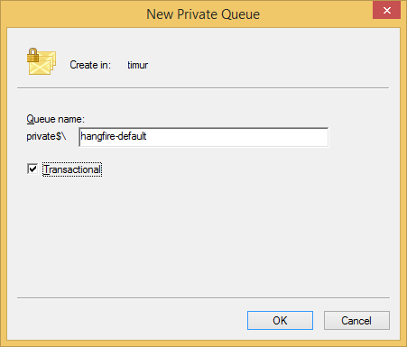

Using SQL Server with MSMQ
===========================

.. admonition:: This extension will be deprecated soon
  :class: warning
  
  Hangfire.SqlServer 1.7.X versions have long-polling feature implemented when using the `recommended settings <https://docs.hangfire.io/en/latest/configuration/using-sql-server.html#configuration>`_ with the latest schema version. Additional technology like MSMQ complicates the application infrastructure, additional storage like MSMQ brings consistency issues on data loss, and MSMQ itself is a complicated technology, especially with DTC transactions. Therefore, the number of disadvantages outweigh all the advantages of using this extension.

`Hangfire.SqlServer.MSMQ <https://www.nuget.org/packages/Hangfire.SqlServer.MSMQ/>`_ extension changes the way Hangfire handles job queues. Default :doc:`implementation <using-sql-server>` uses regular SQL Server tables to organize queues, and this extensions uses transactional MSMQ queues to process jobs. Please note that starting from 1.7.0 it's possible to use ``TimeSpan.Zero`` as a polling delay in Hangfire.SqlServer, so think twice before using MSMQ.

Installation
-------------

MSMQ support for SQL Server job storage implementation, like other Hangfire extensions, is a NuGet package. So, you can install it using NuGet Package Manager Console window:

.. code-block:: powershell

   PM> Install-Package Hangfire.SqlServer.Msmq

Microsoft Message Queuing (MSMQ) Configuration
--------------

To use MSMQ queues, you should do the following steps:

1. **Create them manually on each host**. Don't forget to grant appropriate permissions. Please note that queue storage is limited to 1048576 KB by default (approximately 2 millions enqueued jobs), you can increase it through the MSMQ properties window. 
2. Register all MSMQ queues in current ``SqlServerStorage`` instance.

To create a new Queue you must first install MSMQ on your windows machine:

1. At a command prompt, run the command OptionalFeatures to open the 'Windows Features' dialog.
2. In the feature tree of the dialog, Check the top-level feature 'Microsoft Message Queue (MSMQ) Server'. This also checks the sub-feature 'Microsoft MessageQueue (MSMQ) Server Core'. The dialog should look like this:

3. Windows displays a dialog to say "Please wait while Windows makes changes to features. This might take several minutes." Wait until the dialog disappears.

Now to create a queue:

1. Right click on “My Computer” → Manage → Services and Applications → Message Queueing:

2. Right click on Private queues (here is how to create public ones – https://technet.microsoft.com/en-us/library/cc776346(v=ws.10).aspx), New, Private Queue, give name, check the Transactional:

3. And then configure Hangfire:

.. code-block:: c#

    var sqlServerStorage = new SqlServerStorage(
        @"Server=.\sqlexpress;Database=Hangfire.Sample;Trusted_Connection=True;");
    sqlServerStorage.UseMsmqQueues(@".\Private$\hangfire-{0}", "default");

Configuration
--------------

If you are using **only default queue**, call the ``UseMsmqQueues`` method just after ``UseSqlServerStorage`` method call and pass the path pattern as an argument.

.. code-block:: c#

    GlobalConfiguration.Configuration
        .UseSqlServerStorage("<connection string or its name>")
        .UseMsmqQueues(@"FormatName:Direct=OS:localhost\hangfire-{0}");

To use multiple queues, you should pass them explicitly:

.. code-block:: c#

    GlobalConfiguration.Configuration
        .UseSqlServerStorage("<connection string or its name>")
        .UseMsmqQueues(@"FormatName:Direct=OS:localhost\hangfire-{0}", "critical", "default");

Limitations
------------

* Only transactional MSMQ queues supported for reliability reasons inside ASP.NET.
* You can not use both SQL Server Job Queue and MSMQ Job Queue implementations in the same server (see below). This limitation relates to Hangfire Server only. You can still enqueue jobs to whatever queues and watch them both in Hangfire Dashboard.

Transition to MSMQ queues
--------------------------

If you have a fresh installation, just use the ``UseMsmqQueues`` method. Otherwise, your system may contain unprocessed jobs in SQL Server. Since one Hangfire Server instance can not process job from different queues, you should deploy :doc:`multiple instances <../background-processing/running-multiple-server-instances>` of Hangfire Server, one listens only MSMQ queues, another – only SQL Server queues. When the latter finish its work (you can see this in Dashboard – your SQL Server queues will be removed), you can remove it safely.

If you are using default queue only, do this:

.. code-block:: c#

    /* This server will process only SQL Server table queues, i.e. old jobs */
    var oldStorage = new SqlServerStorage("<connection string or its name>");
    var oldOptions = new BackgroundJobServerOptions();

    app.UseHangfireServer(oldOptions, oldStorage);

    /* This server will process only MSMQ queues, i.e. new jobs */
    GlobalConfiguration.Configuration
        .UseSqlServerStorage("<connection string or its name>")
        .UseMsmqQueues(@"FormatName:Direct=OS:localhost\hangfire-{0}");

    app.UseHangfireServer();

If you use multiple queues, do this:

.. code-block:: c#

    /* This server will process only SQL Server table queues, i.e. old jobs */
    var oldStorage = new SqlServerStorage("<connection string>");
    var oldOptions = new BackgroundJobServerOptions
    {
        Queues = new [] { "critical", "default" }, // Include this line only if you have multiple queues
    };

    app.UseHangfireServer(oldOptions, oldStorage);

    /* This server will process only MSMQ queues, i.e. new jobs */
    GlobalConfiguration.Configuration
        .UseSqlServerStorage("<connection string or its name>")
        .UseMsmqQueues(@"FormatName:Direct=OS:localhost\hangfire-{0}", "critical", "default");

    app.UseHangfireServer();
