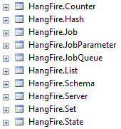

Using SQL Server
=================

SQL Server is the default storage for Hangfire – it is well known to many .NET developers and used in many project environments. It might be interesting that in the early stage of Hangfire development, Redis was used to store information about jobs, and SQL Server storage implementation was inspired by that NoSQL solution.

.. admonition:: Supported database engines
   :class: note

   **Microsoft SQL Server 2008R2** (any edition, including LocalDB) and later, **Microsoft SQL Azure**.

SQL Server storage implementation is available through the ``Hangfire.SqlServer`` NuGet package. To install it, you can modify your ``*.csproj`` file to include the following lines or simply install it via the `NuGet Package Manager <https://learn.microsoft.com/en-us/nuget/consume-packages/install-use-packages-visual-studio>`_.

.. code-block:: xml

   <ItemGroup>
     <PackageReference Include="Hangfire.SqlServer" Version="1.7.*" />
   </ItemGroup>

This package is a dependency of the Hangfire's bootstrapper package ``Hangfire``, so if you installed it, you don't need to install the ``Hangfire.SqlServer`` separately – it was already added to your project.

``Hangfire.SqlServer`` package is dependent on the .NET's ``System.Data.SqlClient`` package, but due to difficulties with managing dependencies with NuGet, lowest supported version will be installed by default. Since there are a lot of problems already fixed in the package, it's much better to install the latest version explicitly in the target application by modifying the ``*.csproj`` file or using NuGet Package Manager.

.. code-block:: xml

   <ItemGroup>
     <PackageReference Include="System.Data.SqlClient" Version="4.*" />
   </ItemGroup>

Configuration
--------------

The package provides extension methods for ``GlobalConfiguration`` class. Choose either a `connection string <https://www.connectionstrings.com/sqlconnection/>`_ to your SQL Server or a connection string name, if you have it.

.. code-block:: c#

   GlobalConfiguration.Configuration
       // Use connection string name defined in `web.config` or `app.config`
       .UseSqlServerStorage("db_connection")
       // Use custom connection string
       .UseSqlServerStorage(@"Server=.\sqlexpress; Database=Hangfire; Integrated Security=SSPI;");

Starting from version 1.7.0 it is recommended to set the following options for new installations (for existing ones, please see :doc:`../upgrade-guides/upgrading-to-hangfire-1.7`). These settings will be turned on by default in 2.0, but meanwhile we should preserve backward compatibility.

.. code-block:: c#

   GlobalConfiguration.Configuration
       .UseSqlServerStorage("db_connection", new SqlServerStorageOptions
       {
           CommandBatchMaxTimeout = TimeSpan.FromMinutes(5),
           SlidingInvisibilityTimeout = TimeSpan.FromMinutes(5),
           QueuePollInterval = TimeSpan.Zero,           
           UseRecommendedIsolationLevel = true,
           DisableGlobalLocks = true // Migration to Schema 7 is required
       });

Installing the Objects
~~~~~~~~~~~~~~~~~~~~~~

Hangfire leverages a couple of tables and indexes to persist background jobs and other information related to the processing:

Some of these tables are used for the core functionality, others fulfill the extensibility needs (making possible to write extensions without changing the underlying schema). Advanced objects like stored procedures, triggers and so on are not used to keep things as simple as possible and allow the library to be used with SQL Azure.

SQL Server objects are **installed automatically** from the ``SqlServerStorage`` constructor by executing statements described in the ``Install.sql`` file (which is located under the ``tools`` folder in the NuGet package). Which contains the migration script, so new versions of Hangfire with schema changes can be installed seamlessly, without your intervention.

If you want to install objects manually, or integrate it with your existing migration subsystem, pass your decision through the SQL Server storage options:

.. code-block:: c#

   var options = new SqlServerStorageOptions
   {
       PrepareSchemaIfNecessary = false
   };

   GlobalConfiguration.Configuration.UseSqlServerStorage("<name or connection string>", options);

You can isolate HangFire database access to just the HangFire schema.  You need to create a separate HangFire user and grant the user access only to the HangFire schema. The HangFire user will only be able to alter the HangFire schema. Below is an example of using a `contained database user <https://msdn.microsoft.com/en-us/library/ff929188.aspx/>`_ for HangFire. The HangFire user has least privileges required but still allows it to upgrade the schema correctly in the future.

.. code-block:: sql

   CREATE USER [HangFire] WITH PASSWORD = 'strong_password_for_hangfire'
   GO
   
   IF NOT EXISTS (SELECT 1 FROM sys.schemas WHERE [name] = 'HangFire') EXEC ('CREATE SCHEMA [HangFire]')
   GO
   
   ALTER AUTHORIZATION ON SCHEMA::[HangFire] TO [HangFire]
   GO
   
   GRANT CREATE TABLE TO [HangFire]
   GO

Configuring the Polling Interval
~~~~~~~~~~~~~~~~~~~~~~~~~~~~~~~~~

One of the main disadvantage of raw SQL Server job storage implementation – it uses the polling technique to fetch new jobs. Starting from Hangfire 1.7.0 it's possible to use ``TimeSpan.Zero`` as a polling interval, when ``SlidingInvisibilityTimeout`` option is set. 

.. code-block:: c#

   var options = new SqlServerStorageOptions
   {
       SlidingInvisibilityTimeout = TimeSpan.FromMinutes(5),
       QueuePollInterval = TimeSpan.Zero
   };

   GlobalConfiguration.Configuration.UseSqlServerStorage("<name or connection string>", options);

This is the recommended value in that version, but you can decrease the polling interval if your background jobs can tolerate additional delay before the invocation.
