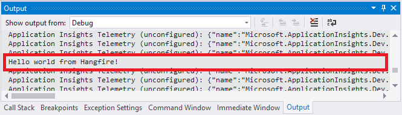

ASP.NET Applications
====================

You can place the background processing in an ASP.NET application without using additional processes like Windows Services. Hangfire's code is ready for unexpected process terminations, application pool recycles and restarts during the deployment process. Since persistent storages are used, you'll not lose any background job.

Installing Hangfire
--------------------

Before we start, we'll need a working ASP.NET application, you can use ASP.NET MVC or ASP.NET WebForms, the steps are almost the same. First of all, the following packages should be installed. There are a lot of ways to install NuGet packages, I'll show how to use package references, since it's the latest method. 

Please note that versions in the code snippet below may be outdated, so use versions from the following badges, they are updated in real-time.

.. |latest-core| image:: https://img.shields.io/nuget/v/Hangfire.Core.svg?label=Hangfire.Core
.. |latest-aspnet| image:: https://img.shields.io/nuget/v/Hangfire.AspNet.svg?label=Hangfire.AspNet
.. |latest-sqlserver| image:: https://img.shields.io/nuget/v/Hangfire.SqlServer.svg?label=Hangfire.SqlServer

|latest-core| |latest-sqlserver| |latest-aspnet|

.. code-block:: xml

   <ItemGroup>
     <PackageReference Include="Hangfire.Core" Version="1.7.0" />
     <PackageReference Include="Hangfire.SqlServer" Version="1.7.0" />
     <PackageReference Include="Hangfire.AspNet" Version="0.2.0" />
   </ItemGroup>

Creating a database
-------------------

As you can see from the snippet above, we'll be using SQL Server as a job storage in this article. Before configuring Hangfire, you'll need to create a database for it or use an existing one. Configuration strings below point to the ``HangfireTest`` database living in the ``SQLEXPRESS`` instance on a local machine.

You can use SQL Server Management Studio or any other way to execute the following SQL command. If you are using other database name or instance, ensure you've changed connection strings when configuring Hangfire during the next steps.

.. code-block:: sql

   CREATE DATABASE [HangfireTest]
   GO

Configuring Hangfire
--------------------

Depending on the age of your application, we'll make some modification either to the ``Startup`` class, or the ``Global.asax.cs`` file. **But not both at the same time**, however nothing terrible will happen in this case, your configuration logic will be executed only once, first invocation wins, but you may get multiple processing servers.

.. admonition:: Configuration settings below for new installations only
   :class: note

   Some of those settings can be incompatible with existing installations, please see the :doc:`Upgrade Guides <../upgrade-guides/index>` instead when upgrading to a newer version.

Using Startup class
~~~~~~~~~~~~~~~~~~~~

If you have a modern (cough, cough) ASP.NET application, then you'd probably have the ``Startup.cs`` file. This case is the simplest case to bootstrap Hangfire and start using background processing. There are some extension methods and their overloads available for the ``IAppBuilder`` class.

All you need is to call them, to start using both Hangfire Dashboard and Hangfire Server.

.. admonition:: Authorization configuration required for non-local requests
   :class: warning

   By default only local access is permitted to the Hangfire Dashboard. `Dashboard authorization <../configuration/using-dashboard.html#configuring-authorization>`_ must be configured in order to allow remote access.

.. code-block:: c#
   :emphasize-lines: 2-3,7-24,28-29,32

   // Startup.cs
   using Hangfire;
   using Hangfire.SqlServer;

   public class Startup
   {
       private IEnumerable<IDisposable> GetHangfireServers()
       {
           GlobalConfiguration.Configuration
               .SetDataCompatibilityLevel(CompatibilityLevel.Version_170)
               .UseSimpleAssemblyNameTypeSerializer()
               .UseRecommendedSerializerSettings()
               .UseSqlServerStorage("Server=.\\SQLEXPRESS; Database=HangfireTest; Integrated Security=True;", new SqlServerStorageOptions
               {
                    CommandBatchMaxTimeout = TimeSpan.FromMinutes(5),
                    SlidingInvisibilityTimeout = TimeSpan.FromMinutes(5),
                    QueuePollInterval = TimeSpan.Zero,           
                    UseRecommendedIsolationLevel = true,
                    UsePageLocksOnDequeue = true,
                    DisableGlobalLocks = true
               });

           yield return new BackgroundJobServer();
       }

       public void Configuration(IAppBuilder app)
       {
           app.UseHangfireAspNet(GetHangfireServers);
           app.UseHangfireDashboard();

           // Let's also create a sample background job
           BackgroundJob.Enqueue(() => Debug.WriteLine("Hello world from Hangfire!"));

           // ...other configuration logic
       }
   }

Using Global.asax.cs file
~~~~~~~~~~~~~~~~~~~~~~~~~~

**Configured using the Startup class? Skip this section.** 

If you can't use the ``Startup`` class for a reason, just use the ``HangfireAspNet`` class and modify the ``Global.asax.cs`` file. You'll not have Hangfire Dashboard in this case, but at least you can start the background processing. If you'd like to install the dashboard also, please google how to add the ``Startup`` class to your project, and go to the previous section.

.. code-block:: c#
   :emphasize-lines: 2-3,7-24,31,34

   // Global.asax.cs
   using Hangfire;
   using Hangfire.SqlServer;

   public class MvcApplication : System.Web.HttpApplication
   {
       private IEnumerable<IDisposable> GetHangfireServers()
       {
           GlobalConfiguration.Configuration
               .SetDataCompatibilityLevel(CompatibilityLevel.Version_170)
               .UseSimpleAssemblyNameTypeSerializer()
               .UseRecommendedSerializerSettings()
               .UseSqlServerStorage("Server=.\\SQLEXPRESS; Database=HangfireTest; Integrated Security=True;", new SqlServerStorageOptions
               {
                    CommandBatchMaxTimeout = TimeSpan.FromMinutes(5),
                    SlidingInvisibilityTimeout = TimeSpan.FromMinutes(5),
                    QueuePollInterval = TimeSpan.Zero,           
                    UseRecommendedIsolationLevel = true,
                    UsePageLocksOnDequeue = true,
                    DisableGlobalLocks = true
               });

           yield return new BackgroundJobServer();
       }

       protected void Application_Start()
       {
           AreaRegistration.RegisterAllAreas();
           RouteConfig.RegisterRoutes(RouteTable.Routes);

           HangfireAspNet.Use(GetHangfireServers);

           // Let's also create a sample background job
           BackgroundJob.Enqueue(() => Debug.WriteLine("Hello world from Hangfire!"));
       }
   }

You might also need to disable OWIN's Startup class detection, when using initialization based on ``Global.asax.cs`` file. The problem is ``Hangfire.AspNet`` package depends on ``Microsoft.Owin.SystemWeb`` package, and it requires OWIN Startup class to be present in your web application. If the following exception appears, just disable the automatic startup in your ``web.config`` file as should below.

.. code-block:: csharp

   EntryPointNotFoundException: The following errors occurred while attempting to load the app.
       - No assembly found containing an OwinStartupAttribute.
       - No assembly found containing a Startup or [AssemblyName].Startup class.

.. code-block:: xml
   :emphasize-lines: 7

   <!-- web.config -->
   <appSettings>
     <add key="webpages:Version" value="3.0.0.0" />
     <add key="webpages:Enabled" value="false" />
     <add key="ClientValidationEnabled" value="true" />
     <add key="UnobtrusiveJavaScriptEnabled" value="true" />
     <add key="owin:AutomaticAppStartup" value="false"/>
   </appSettings>

Running Application
--------------------

Run your application in the Debug mode by pressing :kbd:`F5` (this is required to see the output of the ``Debug.WriteLine`` method). Then check the *Output* window for the following message to see whether background processing has started successfully.

When application is started, open the following URL (assuming your app is running on the 5000 port) to access to the Hangfire Dashboard interface. As we can see, our background job was completed successfully. 

.. admonition:: Startup class is required for Dashboard UI
   :class: note

   Please note, Dashboard UI is available only if you were using the Startup class to configure Hangfire.

.. code-block:: bash

   http://<your-web-app>/hangfire

.. image:: first-job.png

That's all, now you are ready to create other background jobs!
