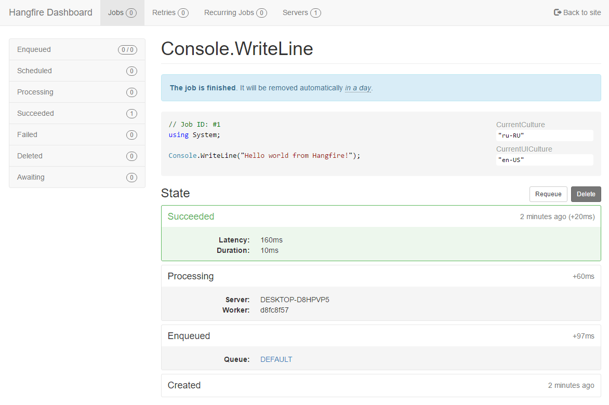

ASP.NET Core Applications
=========================

Before we start with our tutorial, we need to have a working ASP.NET Core application. This documentation is devoted to Hangfire, please, read the official ASP.NET Core Documentation to learn the details on how to create and initialize a new web application: `Getting Started <https://docs.microsoft.com/en-us/aspnet/core/getting-started>`_ and `Tutorials <https://docs.microsoft.com/en-us/aspnet/core/tutorials/>`_.

Installing Hangfire
--------------------

Hangfire is available as a set of NuGet packages, so you need to add them to the ``*.csproj`` file by adding new ``PackageReference`` tags as below.

.. code-block:: xml
   :emphasize-lines: 2-5

   <ItemGroup>
     <PackageReference Include="Hangfire.Core" Version="1.8.*" />
     <PackageReference Include="Hangfire.SqlServer" Version="1.8.*" />
     <PackageReference Include="Hangfire.AspNetCore" Version="1.8.*" />
     <PackageReference Include="Microsoft.Data.SqlClient" Version="*" />
   </ItemGroup>

Creating a database
-------------------

As you can see from the snippet above, we'll be using SQL Server as a job storage in this article. Before configuring Hangfire, you'll need to create a database for it, or use an existing one. Configuration strings below point to the ``HangfireTest`` database living in the ``SQLEXPRESS`` instance on a local machine.

You can use SQL Server Management Studio or any other way to execute the following SQL command. If you are using an other database name or instance, ensure you've changed the connection strings when configuring Hangfire during the next steps.

.. code-block:: sql

   CREATE DATABASE [HangfireTest]
   GO

Configuring Hangfire
---------------------

We'll start our configuration process with defining a configuration string for the ``Hangfire.SqlServer`` package. Consider you have an ``sqlexpress`` named instance running on localhost, and **just created the "HangfireTest" database**. The current user should be able to create tables, to allow automatic migrations to do their job.

Also, the ``Hangfire.AspNetCore`` package has a logging integration with ASP.NET Core applications. Hangfire's log messages are sometimes very important and help to diagnose different issues. ``Information`` level allows to see how Hangfire is working, and ``Warning`` and higher log levels help to investigate problems.

Configuring Settings
~~~~~~~~~~~~~~~~~~~~

Open the ``appsettings.json`` file, and add the highlighted lines from the following snippet.

.. code-block:: json
   :emphasize-lines: 2-4,8

   {
     "ConnectionStrings": {
       "HangfireConnection": "Server=.\\sqlexpress;Database=HangfireTest;Integrated Security=SSPI;"
     },
     "Logging": {
       "LogLevel": {
         "Default": "Warning",
         "Hangfire": "Information"
       }
     }
   }

After updating the application settings, open the ``Startup.cs`` file. The startup class is the heart of an ASP.NET Core application's configuration. First, we need to import the ``Hangfire`` namespace.

.. code-block:: csharp
   :emphasize-lines: 3,4
   
   // ...
   using Microsoft.Extensions.DependencyInjection;
   using Hangfire;
   using Hangfire.SqlServer;

Registering Services
~~~~~~~~~~~~~~~~~~~~

Dependency Injection is one of the primary techniques introduced in ASP.NET Core. The ``Hangfire.AspNetCore`` integration package adds an extension method to register all the services, their implementation, as well as logging and a job activator. As a parameter, it takes an action that allows to configure Hangfire itself.

.. admonition:: Configuration settings below for new installations only
   :class: note

   Some of those settings can be incompatible with existing installations, please see the :doc:`Upgrade Guides <../upgrade-guides/index>` instead, when upgrading to a newer version.

.. code-block:: csharp
   :emphasize-lines: 4-8, 11

   public void ConfigureServices(IServiceCollection services)
   {
       // Add Hangfire services.
       services.AddHangfire(configuration => configuration
           .SetDataCompatibilityLevel(CompatibilityLevel.Version_180)
           .UseSimpleAssemblyNameTypeSerializer()
           .UseRecommendedSerializerSettings()
           .UseSqlServerStorage(Configuration.GetConnectionString("HangfireConnection")));

       // Add the processing server as IHostedService
       services.AddHangfireServer();

       // Add framework services. 
       services.AddMvc();
   }

Adding Dashboard UI
~~~~~~~~~~~~~~~~~~~

After registering Hangfire types, you can now choose features you need to add to your application. The following snippet shows you how to add the Dashboard UI to use all the Hangfire features immediately. The following lines are fully optional, and you can remove them completely, if your application will only create background jobs, as separate application will process them.

.. admonition:: Authorization configuration required for non-local requests
   :class: warning

   By default only local access is permitted to the Hangfire Dashboard. `Dashboard authorization <../configuration/using-dashboard.html#configuring-authorization>`__ must be configured in order to allow remote access.

.. code-block:: csharp
   :emphasize-lines: 1,6,7

   public void Configure(IApplicationBuilder app, IBackgroundJobClient backgroundJobs, IHostingEnvironment env)
   {
       // ...
       app.UseStaticFiles();

       app.UseHangfireDashboard();
       backgroundJobs.Enqueue(() => Console.WriteLine("Hello world from Hangfire!"));

       app.UseMvc(routes =>
       {
           routes.MapRoute(
               name: "default",
               template: "{controller=Home}/{action=Index}/{id?}");
       });
   }

Starting with ``Hangfire.AspNetCore 1.7.8``, Hangfire officially supports ASP.NET Core 3.0 endpoint routing. When using ``RequireAuthorization`` with ``MapHangfireDashboard``, be cautious that only local access is allowed by default.

.. code-block:: csharp
   :emphasize-lines: 6,9
   
    // This method gets called by the runtime. Use this method to configure the HTTP request pipeline.
    public void Configure(IApplicationBuilder app, IWebHostEnvironment env)
    {
        app.UseRouting();
        app.UseAuthorization();
        app.UseEndpoints(endpoints =>
        {
            endpoints.MapControllers();
            endpoints.MapHangfireDashboard();
        });
    }
    
    

Running Application
--------------------

Run the following command to start an application, or click the :kbd:`F5` button in Visual Studio.

.. code-block:: bash
   
   dotnet run

After the application has been started and background processing was started successfully, the following messages should appear. 

.. code-block:: bash

    info: Hangfire.SqlServer.SqlServerStorage[0]
        Start installing Hangfire SQL objects...
        Hangfire SQL objects installed.
        Using job storage: 'SQL Server: .\@AspNetCoreTest'
        Using the following options for SQL Server job storage:
            Queue poll interval: 00:00:15.
    info: Hangfire.BackgroundJobServer[0]
        Starting Hangfire Server...
        Using the following options for Hangfire Server:
            Worker count: 20
            Listening queues: 'default'
            Shutdown timeout: 00:00:15
            Schedule polling interval: 00:00:15

These lines contain messages regarding SQL Server Job Storage that is used to persist background jobs, and the Background Job Server, which is processing all the background jobs.

The following message should also appear, since we created background job, whose only behavior is to write a message to the console.

.. code-block:: bash

   Hello world from Hangfire!

When the application has started, open the following URL (assuming your app is running on the 5000 port), to access to the Hangfire Dashboard interface. As we can see, our background job was completed successfully.

.. code-block:: bash

   http://localhost:5000/hangfire

When you finished working with the application, press the :kbd:`Ctrl+C` in your console window to stop the application. The following message should appear telling you that background processing server was stopped gracefully.

.. code-block:: bash

   info: Hangfire.BackgroundJobServer[0]
      Hangfire Server stopped.

You can also kill your process, but in this case some background jobs may be delayed in invocation.
